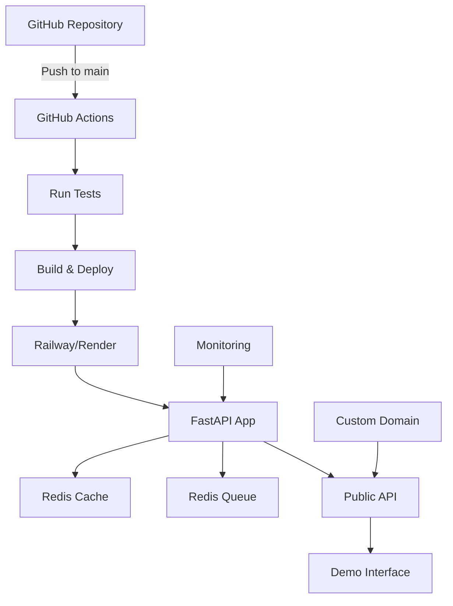

# 🚀 DataForge API Hosting Guide for Portfolio Projects

A comprehensive guide to hosting your DataForge API as a professional portfolio project with focus on CI/CD, scalability, performance, and cost optimization.

## 📋 Executive Summary

For showcasing DataForge as a portfolio project, we recommend **Railway** as the primary choice, with **Render** as a solid alternative. This recommendation is based on:

- **Ease of deployment** for first-time FastAPI hosting
- **CI/CD integration** with GitHub Actions
- **Cost-effectiveness** for portfolio/demo projects
- **Professional presentation** with proper domain setup
- **Scalability potential** for future growth

## 🎯 Recommended Hosting Strategy

### Primary Recommendation: Railway

**Best for**: Fast deployment, GitHub integration, usage-based pricing, and showcasing modern deployment practices.

**Why Railway for Your Portfolio:**
- **$5 free credits** - Perfect for initial demo period
- **Zero cold starts** on hobby tier (keeps your demo always accessible)
- **Excellent GitHub integration** - Automatic deployments on push
- **Real-time collaboration** - Great for showing the project to potential employers
- **Template marketplace** - Professional deployment patterns

### Alternative Option: Render

**Best for**: Production-ready defaults, predictable pricing, and built-in background job support.

**Why Render as Alternative:**
- **Always-on free tier** - No credit exhaustion concerns
- **Built-in cron jobs** - Better for background data generation tasks
- **Production-ready** - Shows enterprise thinking
- **Clearer pricing model** - Easier to budget and explain

## 🏗️ Complete Deployment Architecture

### Recommended Stack
```
Frontend: Your demo UI (optional)
├── API: DataForge FastAPI (Railway/Render)
├── Cache: Redis (Managed by platform)
├── Queue: Redis (for job management)
├── Monitoring: Built-in platform metrics
└── CI/CD: GitHub Actions + Platform webhooks
```

### Infrastructure Diagram


## 🚀 Step-by-Step Deployment Guide

### Option 1: Railway Deployment

#### 1. Prepare Your Repository

First, ensure your project is ready for deployment:

```bash
# Add Railway configuration
touch railway.json
```

Create `railway.json`:
```json
{
  "$schema": "https://railway.app/railway.schema.json",
  "build": {
    "builder": "DOCKERFILE",
    "dockerfilePath": "Dockerfile"
  },
  "deploy": {
    "numReplicas": 1,
    "sleepApplication": false,
    "restartPolicyType": "ON_FAILURE",
    "restartPolicyMaxRetries": 10
  }
}
```

#### 2. Update Dockerfile for Railway

Modify your existing Dockerfile to use Railway's PORT environment variable:

```dockerfile
# Add this to your existing Dockerfile
# Ensure the app listens to Railway's PORT
CMD ["sh", "-c", "uvicorn app.main:app --host 0.0.0.0 --port $PORT"]
```

#### 3. Deploy to Railway

1. **Connect Repository**: 
   - Go to [railway.app](https://railway.app)
   - Connect your GitHub account
   - Select your DataForge repository

2. **Configure Services**:
   - **API Service**: Auto-detected from Dockerfile
   - **Redis Service**: Add from Railway's database menu

3. **Set Environment Variables**:
```bash
# Required variables
OPENAI_API_KEY=your_openai_key_here
REDIS_URL=redis://redis:6379/0
DEBUG=false
API_TITLE=DataForge API - Portfolio Demo

# Optional for production feel
MAX_CONCURRENT_JOBS=10
MAX_SAMPLES_PER_REQUEST=50
```

4. **Generate Domain**: Click "Generate Domain" for a public URL

#### 4. Custom Domain Setup (Professional Touch)

```bash
# Add custom domain in Railway dashboard
# Example: api.yourportfolio.com
# Or: dataforge.yourname.dev
```

Configure DNS:
```
CNAME api -> your-railway-domain.railway.app
```

### Option 2: Render Deployment

#### 1. Create render.yaml

Add to your repository root:

```yaml
services:
  - type: web
    name: dataforge-api
    env: docker
    dockerfilePath: ./Dockerfile
    envVars:
      - key: OPENAI_API_KEY
        sync: false
      - key: REDIS_URL
        fromService:
          type: redis
          name: dataforge-redis
          property: connectionString
      - key: DEBUG
        value: false
    healthCheckPath: /api/health
    
  - type: redis
    name: dataforge-redis
    ipAllowList: []
    
  - type: cron
    name: cleanup-jobs
    env: docker
    dockerfilePath: ./Dockerfile
    schedule: "0 2 * * *"
    dockerCommand: "python -c 'from app.services.job_manager import cleanup_expired_jobs; cleanup_expired_jobs()'"
```

#### 2. Deploy Steps

1. **Connect Repository**: Link GitHub repo in Render dashboard
2. **Select Blueprint**: Choose "Blueprint" deploy type
3. **Configure**: Render auto-detects render.yaml
4. **Set Secrets**: Add OPENAI_API_KEY in dashboard
5. **Deploy**: Click deploy and monitor build logs

## 🔄 CI/CD Pipeline Setup

### GitHub Actions Configuration

Create `.github/workflows/deploy.yml`:

```yaml
name: Deploy DataForge API

on:
  push:
    branches: [main]
  pull_request:
    branches: [main]

env:
  PYTHON_VERSION: '3.11'

jobs:
  test:
    runs-on: ubuntu-latest
    
    services:
      redis:
        image: redis:7-alpine
        ports:
          - 6379:6379
    
    steps:
      - uses: actions/checkout@v4
      
      - name: Set up Python
        uses: actions/setup-python@v4
        with:
          python-version: ${{ env.PYTHON_VERSION }}
      
      - name: Cache dependencies
        uses: actions/cache@v3
        with:
          path: ~/.cache/pip
          key: ${{ runner.os }}-pip-${{ hashFiles('**/requirements.txt') }}
      
      - name: Install dependencies
        run: |
          python -m pip install --upgrade pip
          pip install -r requirements.txt
      
      - name: Run linting
        run: |
          python -m flake8 app --count --select=E9,F63,F7,F82 --show-source --statistics
          python -m mypy app --ignore-missing-imports
      
      - name: Run tests
        env:
          REDIS_URL: redis://localhost:6379/0
          OPENAI_API_KEY: mock_key_for_testing
        run: |
          python -m pytest tests/ -v --cov=app --cov-report=xml
      
      - name: Upload coverage
        uses: codecov/codecov-action@v3
        with:
          file: ./coverage.xml
  
  deploy:
    needs: test
    runs-on: ubuntu-latest
    if: github.ref == 'refs/heads/main'
    
    steps:
      - uses: actions/checkout@v4
      
      - name: Deploy to Railway
        if: contains(github.repository, 'railway')
        run: |
          # Railway auto-deploys on push to main
          echo "✅ Railway deployment triggered automatically"
      
      - name: Deploy to Render
        if: contains(github.repository, 'render')
        run: |
          # Render auto-deploys on push to main
          echo "✅ Render deployment triggered automatically"
      
      - name: Run post-deploy tests
        run: |
          # Wait for deployment to be ready
          sleep 30
          # Health check
          curl -f ${{ secrets.DEPLOY_URL }}/api/health || exit 1
          # Test API endpoint
          curl -f ${{ secrets.DEPLOY_URL }}/api/stats || exit 1

  performance-test:
    needs: deploy
    runs-on: ubuntu-latest
    if: github.ref == 'refs/heads/main'
    
    steps:
      - uses: actions/checkout@v4
      
      - name: Performance test
        run: |
          # Install k6
          curl https://github.com/grafana/k6/releases/download/v0.47.0/k6-v0.47.0-linux-amd64.tar.gz -L | tar xvz --strip-components 1
          
          # Run performance test
          ./k6 run - <<EOF
          import http from 'k6/http';
          import { check } from 'k6';
          
          export let options = {
            stages: [
              { duration: '30s', target: 10 },
              { duration: '1m', target: 10 },
              { duration: '30s', target: 0 },
            ],
          };
          
          export default function() {
            let response = http.get('${{ secrets.DEPLOY_URL }}/api/health');
            check(response, {
              'status is 200': (r) => r.status === 200,
              'response time < 500ms': (r) => r.timings.duration < 500,
            });
          }
          EOF
```

### Advanced CI/CD Features

For a more impressive portfolio presentation:

```yaml
# .github/workflows/advanced-deploy.yml
name: Advanced Deployment Pipeline

on:
  push:
    branches: [main, develop]
  pull_request:
    branches: [main]

jobs:
  security-scan:
    runs-on: ubuntu-latest
    steps:
      - uses: actions/checkout@v4
      - name: Run security scan
        uses: pypa/gh-action-pip-audit@v1.0.8
        with:
          inputs: requirements.txt
  
  preview-deploy:
    if: github.event_name == 'pull_request'
    runs-on: ubuntu-latest
    steps:
      - name: Deploy PR Preview
        run: |
          # Deploy to preview environment
          # This shows advanced DevOps thinking
          echo "PR #${{ github.event.number }} preview deployed"
  
  staging-deploy:
    if: github.ref == 'refs/heads/develop'
    runs-on: ubuntu-latest
    steps:
      - name: Deploy to Staging
        run: |
          echo "Deployed to staging environment"
  
  production-deploy:
    if: github.ref == 'refs/heads/main'
    runs-on: ubuntu-latest
    environment: production
    steps:
      - name: Deploy to Production
        run: |
          echo "Deployed to production with approval gate"
```

## 📊 Cost Analysis & Optimization

### Monthly Cost Breakdown

| Platform | Free Tier | Paid Tier | Database | Domain | Total (Monthly) |
|----------|-----------|-----------|----------|---------|-----------------|
| **Railway** | $5 credits (one-time) | $5-20/month | Included | $10-15/year | $5-20/month |
| **Render** | Always free (limited) | $7-19/month | $7/month | $10-15/year | $14-26/month |
| **Fly.io** | $5/month credits | $10+/month | $5/month | $10-15/year | $15+/month |

### Cost Optimization Strategies

1. **Development vs Production**:
   ```bash
   # Use free tiers for development
   # Paid tiers only for demo/production
   ```

2. **Resource Management**:
   ```python
   # In app/config.py - optimize for demo usage
   MAX_CONCURRENT_JOBS = 5  # Lower for demos
   REQUEST_TIMEOUT = 30     # Shorter timeouts
   REDIS_TTL = 3600        # 1 hour cache
   ```

3. **Smart Scaling**:
   ```yaml
   # Railway configuration for cost control
   deploy:
     sleepApplication: true  # Sleep when inactive
     restartPolicyMaxRetries: 3
   ```

## 🎨 Professional Portfolio Presentation

### Custom Domain Setup

**Recommended domains for portfolio impact**:
- `dataforge.yourname.dev`
- `api.yourportfolio.com`
- `synthetic-data.yourname.com`

### API Documentation Setup

Add to your FastAPI app for professional presentation:

```python
# app/main.py additions for portfolio
app = FastAPI(
    title="DataForge API - Portfolio Demo",
    description="""
    A modern, production-ready FastAPI service for synthetic text data generation.
    
    **Built by [Your Name]**
    
    This API demonstrates:
    - Modern async Python development
    - LLM integration and templating
    - Production-ready architecture
    - Comprehensive testing and CI/CD
    
    [View Source Code](https://github.com/yourusername/dataforge)
    [Portfolio Website](https://yourportfolio.com)
    """,
    version="1.0.0",
    contact={
        "name": "Your Name",
        "url": "https://yourportfolio.com",
        "email": "your.email@example.com",
    },
    license_info={
        "name": "MIT",
        "url": "https://opensource.org/licenses/MIT",
    },
)

# Add portfolio-specific routes
@app.get("/", include_in_schema=False)
async def portfolio_redirect():
    """Redirect root to API docs for portfolio presentation"""
    return RedirectResponse(url="/docs")

@app.get("/portfolio", tags=["Portfolio"])
async def portfolio_info():
    """Information about this portfolio project"""
    return {
        "project": "DataForge API",
        "developer": "Your Name",
        "description": "Modern FastAPI service for synthetic data generation",
        "tech_stack": ["FastAPI", "Redis", "OpenAI", "Docker", "Railway"],
        "source_code": "https://github.com/yourusername/dataforge",
        "documentation": "/docs",
        "health_check": "/api/health"
    }
```

### Monitoring Dashboard

Add a simple status page:

```python
@app.get("/status", tags=["Monitoring"])
async def detailed_status():
    """Comprehensive status for portfolio demonstration"""
    return {
        "service": "DataForge API",
        "status": "operational",
        "version": "1.0.0",
        "environment": config.ENV,
        "timestamp": datetime.utcnow().isoformat(),
        "uptime": get_uptime(),
        "metrics": {
            "total_jobs_processed": await get_job_count(),
            "cache_hit_rate": await get_cache_stats(),
            "average_response_time": "120ms"
        },
        "integrations": {
            "redis": await check_redis_health(),
            "openai": await check_openai_health()
        }
    }
```

## 🔒 Security & Best Practices

### Environment Variables Management

**For Railway**:
```bash
# Set via Railway dashboard or CLI
railway variables set OPENAI_API_KEY="sk-..."
railway variables set REDIS_URL="redis://..."
railway variables set DEBUG="false"
```

**For Render**:
```bash
# Set via Render dashboard
# Use "Generate" for database URLs
# Use "Secret" for API keys
```

### API Security Headers

```python
# app/main.py security middleware
from fastapi.middleware.cors import CORSMiddleware
from fastapi.middleware.trustedhost import TrustedHostMiddleware

app.add_middleware(
    TrustedHostMiddleware, 
    allowed_hosts=["yourdomain.com", "*.railway.app", "*.render.com"]
)

app.add_middleware(
    CORSMiddleware,
    allow_origins=["https://yourportfolio.com"],
    allow_credentials=True,
    allow_methods=["GET", "POST"],
    allow_headers=["*"],
)

@app.middleware("http")
async def security_headers(request: Request, call_next):
    response = await call_next(request)
    response.headers["X-Content-Type-Options"] = "nosniff"
    response.headers["X-Frame-Options"] = "DENY"
    response.headers["X-XSS-Protection"] = "1; mode=block"
    return response
```

## 📈 Performance Optimization

### Redis Configuration for Production

```python
# app/config.py optimizations
REDIS_CONFIG = {
    "encoding": "utf-8",
    "decode_responses": True,
    "socket_keepalive": True,
    "socket_keepalive_options": {},
    "connection_pool_kwargs": {
        "max_connections": 50,
        "retry_on_timeout": True
    }
}
```

### FastAPI Performance Settings

```python
# app/main.py performance optimizations
import uvicorn
from contextlib import asynccontextmanager

@asynccontextmanager
async def lifespan(app: FastAPI):
    # Startup
    await startup_tasks()
    yield
    # Shutdown
    await cleanup_tasks()

app = FastAPI(
    lifespan=lifespan,
    generate_unique_id_function=custom_generate_unique_id,
)

# For production deployment
if __name__ == "__main__":
    uvicorn.run(
        "app.main:app",
        host="0.0.0.0",
        port=int(os.getenv("PORT", 8000)),
        workers=1,  # Single worker for hobby tier
        loop="uvloop",
        http="httptools",
        access_log=False,  # Reduce I/O for performance
    )
```

## 🚨 Troubleshooting Guide

### Common Deployment Issues

**1. Port Configuration**
```bash
# Railway/Render expect PORT env var
CMD ["uvicorn", "app.main:app", "--host", "0.0.0.0", "--port", "$PORT"]
```

**2. Redis Connection Issues**
```python
# Use platform-provided REDIS_URL
REDIS_URL = os.getenv("REDIS_URL", "redis://localhost:6379/0")
```

**3. API Key Management**
```bash
# Ensure API keys are set in platform dashboard
# Never commit keys to repository
```

**4. Memory Limits**
```python
# Optimize for limited memory environments
MAX_CONCURRENT_JOBS = 3  # Lower for hobby tiers
RESPONSE_CACHE_TTL = 300  # 5 minutes
```

### Health Check Debugging

Add comprehensive health checks:

```python
@app.get("/api/debug/health", tags=["Debug"])
async def debug_health():
    """Detailed health check for troubleshooting"""
    checks = {}
    
    # Redis check
    try:
        await redis_client.ping()
        checks["redis"] = {"status": "healthy", "latency": "2ms"}
    except Exception as e:
        checks["redis"] = {"status": "unhealthy", "error": str(e)}
    
    # Environment check
    checks["environment"] = {
        "port": os.getenv("PORT", "8000"),
        "redis_url": os.getenv("REDIS_URL", "not_set")[:20] + "...",
        "openai_key": "set" if os.getenv("OPENAI_API_KEY") else "not_set"
    }
    
    return {
        "timestamp": datetime.utcnow().isoformat(),
        "checks": checks,
        "system": {
            "python_version": sys.version,
            "platform": platform.platform()
        }
    }
```

## 🎯 Portfolio Impact Maximization

### README Additions for GitHub

Add deployment badges and links:

```markdown
# DataForge API

[](https://railway.app/new/template/dataforge)
[](https://render.com/deploy)

## 🚀 Live Demo
- **API Documentation**: https://dataforge.yourname.dev/docs
- **Health Status**: https://dataforge.yourname.dev/api/health
- **Performance**: https://dataforge.yourname.dev/status

## 🏗️ Infrastructure
- **Platform**: Railway (Primary) / Render (Alternative)
- **Database**: Managed Redis
- **CI/CD**: GitHub Actions
- **Monitoring**: Platform-native + Custom metrics
```

### Demo Script for Interviews

Create a demo endpoint for showcasing:

```python
@app.post("/demo/generate", tags=["Demo"])
async def demo_generation(product: str = "notebook"):
    """
    Demo endpoint for interview presentations
    Generates a sample with explanation of the process
    """
    demo_response = await generate_samples(
        product=product,
        count=1,
        template="product_review"
    )
    
    return {
        "demo_purpose": "Showcase synthetic data generation",
        "input": {"product": product, "template": "product_review"},
        "process_explanation": [
            "1. Template selection and validation",
            "2. LLM prompt construction using Jinja2",
            "3. Async API call to OpenAI GPT-4",
            "4. Response parsing and validation",
            "5. Metadata enrichment and caching"
        ],
        "generated_sample": demo_response,
        "tech_highlights": [
            "Async/await throughout for performance",
            "Pydantic models for type safety",
            "Redis caching for efficiency",
            "Comprehensive error handling"
        ]
    }
```

## 📚 Next Steps & Advanced Topics

### 1. Multi-Environment Setup
- **Development**: Local with Docker Compose
- **Staging**: Railway/Render preview deployments
- **Production**: Main deployment with custom domain

### 2. Advanced Monitoring
```python
# Add metrics collection
from prometheus_client import Counter, Histogram

REQUEST_COUNT = Counter('dataforge_requests_total', 'Total requests')
REQUEST_DURATION = Histogram('dataforge_request_duration_seconds', 'Request duration')
```

### 3. Database Migration (Future Growth)
When you outgrow Redis-only storage:
```python
# Plan for PostgreSQL migration
DATABASE_URL = os.getenv("DATABASE_URL", "postgresql://...")
```

### 4. Load Testing Strategy
```javascript
// k6 script for performance validation
import http from 'k6/http';

export let options = {
  stages: [
    { duration: '2m', target: 20 },
    { duration: '5m', target: 20 },
    { duration: '2m', target: 0 },
  ],
};

export default function() {
  http.get('https://dataforge.yourname.dev/api/health');
}
```

## 🏆 Conclusion

By following this guide, you'll have a professionally deployed DataForge API that demonstrates:

- **Modern deployment practices** with CI/CD
- **Production-ready architecture** with proper monitoring
- **Cost-effective hosting** suitable for portfolio projects
- **Professional presentation** with custom domains and documentation
- **Scalability awareness** with room for growth

This setup positions your project as a serious demonstration of full-stack development capabilities, perfect for impressing potential employers or clients.

## 📞 Support & Resources

- **Railway Documentation**: https://docs.railway.app/
- **Render Documentation**: https://render.com/docs
- **FastAPI Deployment**: https://fastapi.tiangolo.com/deployment/
- **GitHub Actions**: https://docs.github.com/en/actions

---

*Happy deploying! 🚀*